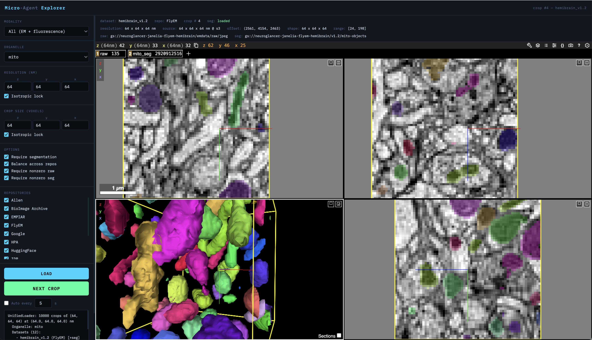

# Micro-Agent

Agentic discovery & access of open-source microscopy data.

Cross-repository microscopy training data discovery and loading. Micro-Agent provides a unified interface to query, load, and visualize EM and fluorescence datasets from multiple public repositories, yielding random crops at a target resolution suitable for training segmentation models.

## Repositories

### Curated (always available)

| Repository | Format | Backend | Datasets |
|---|---|---|---|
| **OpenOrganelle** | Zarr / N5 on S3 | `OpenOrganelleBackend` | 51 (FIB-SEM, organelle segmentations) |
| **MICrONS** | Neuroglancer Precomputed on GCS | `MICrONSBackend` | 2 (minnie65, minnie35) |
| **FlyEM** | Neuroglancer Precomputed on GCS | `MICrONSBackend` | 4 (hemibrain, MANC, optic lobe, FIB-25) |
| **Google** | Neuroglancer Precomputed on GCS | `MICrONSBackend` | 4 (H01, FAFB, FlyWire, Kasthuri) |
| **OpenNeuroData** | Neuroglancer Precomputed on S3 | `MICrONSBackend` | 5 (Bock, Hildebrand, Harris, Wanner, Witvliet) |
| **EMPIAR** | TIFF slices over HTTPS | `EMPIARBackend` | 1 (on-demand slice download with local cache) |
| **IDR** | OME-Zarr on EBI S3 | `IDRBackend` | 1 |
| **CellMap Publications** | N5 on S3 | `OpenOrganelleBackend` | 1 (Heinrich 2021 ground truth crops) |

### Discovered (via `pixi run discover`)

| Repository | Modality | Format | Data access | Source |
|---|---|---|---|---|
| **OpenOrganelle** | EM | N5 on S3 | Random-access crops | S3 bucket scan |
| **EMPIAR** | EM | TIFF | Catalog only | REST API probe |
| **IDR** | Fluorescence / EM | OME-Zarr on EBI S3 | Random-access (plate zarr) | OMERO API drill-down |
| **BioImage Archive** | EM / Fluorescence | Various | Catalog only | BioStudies API search |
| **Allen Institute** | Fluorescence | OME-TIFF on S3 | Random-access crops | S3 bucket scan |
| **Human Protein Atlas** | Fluorescence | TIFF | Catalog only | HPA subcellular API |
| **Cell Image Library** | Fluorescence / EM | TIFF | Catalog only | CIL JSON API |
| **Zenodo** | Fluorescence / EM | Various | Catalog only | Zenodo REST API |
| **HuggingFace** | Fluorescence / EM | Various | Catalog only | HuggingFace Hub API |
| **OpenAlex** | Fluorescence / EM | Various | Catalog only | OpenAlex literature API |
| **BossDB** | EM | Neuroglancer Precomputed on S3 | Random-access crops (WIP) | BossDB REST API + S3 verification |

## Quick start

```bash
# Install with pixi
pixi install

# Search the registry
pixi run demo

# Open the web explorer
pixi run explore

# Discover datasets from public repositories
pixi run discover

# Run LLM-driven discovery agent
pixi run discover-agent --focus "light-sheet fluorescence"
```

## Python API

The `UnifiedLoader` is the single entry point for all data access. Any external tool or training pipeline can use it to get crops from any supported repository — no need for repository-specific code.

### UnifiedLoader parameters

| Parameter | Type | Default | Description |
|---|---|---|---|
| `organelle` | `str` | `""` | Target organelle for segmentation (e.g., `"mito"`, `"er"`, `"neuron"`) |
| `crop_size` | `(z, y, x)` | `(64, 64, 64)` | Output crop size in voxels |
| `resolution_nm` | `(z, y, x)` or `None` | `None` | Target voxel size in nm. Auto-selects best scale and resamples. `None` = native resolution. |
| `modality_class` | `str` | `""` | Filter by modality: `"em"`, `"fluorescence"`, or `""` for both |
| `query` | `str` | `""` | Free-text search across dataset titles and IDs |
| `organism` | `str` | `""` | Filter by organism (e.g., `"Homo sapiens"`, `"Drosophila melanogaster"`) |
| `cell_type` | `str` | `""` | Filter by cell type (e.g., `"HeLa"`) |
| `repositories` | `list[str]` or `None` | `None` | Restrict to specific repos (e.g., `["OpenOrganelle", "FlyEM"]`). `None` = all. |
| `num_samples` | `int` | `1000` | Number of crops to yield |
| `seed` | `int` or `None` | `None` | Random seed for reproducibility |
| `require_segmentation` | `bool` | `False` | Only use datasets that have segmentation for the given organelle |
| `balance_repositories` | `bool` | `False` | Sample equally across repositories (otherwise weighted by dataset count) |
| `require_nonempty_raw` | `bool` | `False` | Skip crops where raw is all zeros |
| `require_nonempty_seg` | `bool` | `False` | Skip crops where segmentation is absent or all zeros |

### CropSample fields

Each yielded `CropSample` contains everything needed to use the crop or trace it back to its source:

| Field | Type | Description |
|---|---|---|
| `raw` | `ndarray (z,y,x)` | Raw image crop at native dtype, resampled to target resolution |
| `segmentation` | `ndarray (z,y,x) uint32` or `None` | Segmentation labels (instance IDs, not binary masks) |
| `raw_multichannel` | `ndarray (c,z,y,x)` or `None` | Multi-channel data at native dtype (fluorescence datasets) |
| `channel_names` | `list[str]` | Channel names (e.g., `["DAPI", "GFP", "Cell membrane"]`) |
| `dataset_id` | `str` | Dataset identifier (e.g., `"jrc_hela-2"`, `"minnie65"`) |
| `repository` | `str` | Source repository name |
| `organelle` | `str` | Organelle that was requested |
| `offset` | `(z, y, x)` | Crop origin in source volume coordinates (at the scale that was read) |
| `resolution_nm` | `(z, y, x)` | Output voxel size in nm |
| `source_resolution_nm` | `(z, y, x)` | Native voxel size at the scale level that was read |
| `scale_used` | `int` | Multiscale level that was read (0 = finest) |
| `seg_status` | `str` | `"loaded"`, `"empty"`, `"failed: ..."`, or `"no_seg_available"` |
| `raw_path` | `str` | Full path/URL to the raw volume |
| `seg_path` | `str` | Full path/URL to the segmentation volume |

### Examples

**Random crops from all mito datasets at 8nm:**

```python
from micro_agent import UnifiedLoader

loader = UnifiedLoader(
    organelle="mito",
    crop_size=(64, 64, 64),
    resolution_nm=(8.0, 8.0, 8.0),
    require_nonempty_seg=True,
    balance_repositories=True,
)

for sample in loader.prefetch_iter():
    # sample.raw: (64, 64, 64) uint8 at 8nm isotropic
    # sample.segmentation: (64, 64, 64) uint32 instance labels
    train(sample.raw, sample.segmentation)
```

**EM-only or fluorescence-only crops:**

```python
# Only EM datasets
loader = UnifiedLoader(modality_class="em", crop_size=(64, 64, 64))

# Only fluorescence datasets
loader = UnifiedLoader(modality_class="fluorescence", crop_size=(64, 64, 64))
for sample in loader:
    if sample.raw_multichannel is not None:
        print(f"Channels: {sample.channel_names}, shape: {sample.raw_multichannel.shape}")
```

**Crops from a specific dataset:**

```python
loader = UnifiedLoader(
    query="minnie65",               # match by name
    organelle="mito",
    crop_size=(128, 128, 128),
    resolution_nm=(16.0, 16.0, 16.0),
)
```

**Crops from specific repositories only:**

```python
loader = UnifiedLoader(
    organelle="er",
    repositories=["OpenOrganelle", "MICrONS"],
    crop_size=(64, 64, 64),
    resolution_nm=(8.0, 8.0, 8.0),
    require_segmentation=True,
)
```

**Raw-only crops at native resolution (no resampling):**

```python
loader = UnifiedLoader(
    organism="Drosophila melanogaster",
    crop_size=(64, 64, 64),
    # resolution_nm omitted → reads at native scale 0
)
```

**Reproducible sampling:**

```python
loader = UnifiedLoader(organelle="mito", seed=42, num_samples=50)
# Same seed + params → same sequence of crops
```

### Resolution-based scale selection

The loader automatically picks the best multiscale level for your target resolution and resamples to match:

- Reads voxel size metadata directly from volume files (neuroglancer precomputed `info` JSON, N5 `attributes.json`, zarr `.zattrs`)
- Picks the coarsest scale still finer than or equal to the target in all dimensions
- Computes per-axis zoom factors (`source_voxel / target_voxel`) and works backwards to determine how many source voxels to read: `read_shape = ceil(crop_size / zoom_factors)`. For example, requesting 64³ at 8nm from a 16nm source (zoom=2.0) reads 32³ source voxels, then resamples up to 64³.
- Resamples with `scipy.ndimage.zoom` (bilinear for raw, nearest-neighbor for segmentation) and trims/pads to exact `crop_size`
- Handles anisotropic data (e.g., MICrONS minnie65 at 8x8x40 nm gets per-axis zoom factors to produce isotropic output)

### Search the registry

```python
from micro_agent import Registry

reg = Registry()

# Filter by organelle, organism, repository, modality
hits = reg.search(organelle="mito", organism="Homo sapiens")
hits = reg.search(repository="FlyEM")
hits = reg.search(query="cortex", has_segmentation=True)
hits = reg.search(modality_class="fluorescence")

# List available metadata
reg.list_organelles()    # ['er', 'golgi', 'mito', 'neuron', ...]
reg.list_organisms()     # ['Caenorhabditis elegans', 'Drosophila melanogaster', ...]
reg.list_repositories()  # ['EMPIAR', 'FlyEM', 'Google', 'IDR', 'MICrONS', ...]
```

### Visualize in neuroglancer

```python
from micro_agent import UnifiedLoader, view_crop

loader = UnifiedLoader(organelle="mito", crop_size=(64,64,64), resolution_nm=(8,8,8))
sample = next(iter(loader))
viewer = view_crop(sample)
# Opens neuroglancer in browser with raw + segmentation overlay
```

## Web explorer



`pixi run explore` starts a local web server with:

- **Modality filter** -- EM only, fluorescence only, or both
- **Control panel** -- organelle, resolution (nm), crop size, repository filters
- **Options** -- require segmentation, balance across repos, require nonzero raw/seg
- **Embedded neuroglancer** viewer with 1-99% intensity scaling and segment ID listing
- **Metadata bar** -- dataset ID, source/output resolution, offset, scale used, raw/seg paths, segmentation status
- **Background prefetching** -- keeps 5 crops ready in a queue for instant cycling
- **Keyboard shortcuts** -- Space or Right Arrow for next crop
- **Auto-cycle** -- automatically advance every N seconds

The server binds to `0.0.0.0` so it's accessible from other machines on the network.

## Dataset discovery

`pixi run discover` scans 11 public repositories in parallel and outputs a `discovered_datasets.json` file. The Registry auto-loads this file on startup, making discovered datasets immediately available to the loader and web explorer.

### Architecture

Discovery uses a scanner module system (`micro_agent/scanners/`). Each scanner implements `BaseScanner` with two methods:

- `scan(limit)` — async method that queries the source API and returns `DiscoveredDataset` entries
- `validate_access(dataset)` — async method that checks whether the data is actually reachable

All scanners run concurrently via `asyncio.gather()` with a 60-second per-scanner timeout. The total discovery time is bounded by the slowest scanner, not the sum.

### Scanners in detail

**OpenOrganelle** (`scanners/openorganelle.py`) — Lists `s3://janelia-cosem-datasets` via s3fs, then for each dataset probes `{id}/{id}.n5/em/` for raw EM data and `{id}/{id}.n5/labels/*_seg` for segmentation labels. Extracts organelle names from directory names. All datasets get `supports_random_access=True` with resolved N5 paths.

**EMPIAR** (`scanners/empiar.py`) — No list-all API endpoint exists, so this scanner probes individual entry IDs (11000 downward) via `https://www.ebi.ac.uk/empiar/api/entry/{id}/`. Extracts titles, organisms, and imaging modalities. Catalog-only (no FTP data paths resolved).

**IDR** (`scanners/idr.py`) — Queries the OMERO JSON API for screens and projects. For screens, resolves actual OME-Zarr data paths by drilling through the API hierarchy:

1. `GET /api/v0/m/screens/` → list screens (uses `@id` and `Name` fields)
2. Extract study prefix from screen name (e.g., `idr0001-graml-sysgro/screenA` → `idr0001A`)
3. `GET /webclient/api/plates/?id={screen_id}` → get plate IDs
4. `GET` plate `.zattrs` on EBI S3 → find first well path
5. `GET` well `.zattrs` → find first image/field path
6. Verify the full zarr path exists: `idr/zarr/v0.4/{study_prefix}/{plate_id}.zarr/{well}/{field}`

Only screens with verified plate zarrs on EBI S3 get `supports_random_access=True`. Projects are catalog-only. Modality is classified by keyword matching in descriptions (fluorescence, confocal, light sheet, GFP, DAPI, FITC → fluorescence).

**BioImage Archive** (`scanners/bia.py`) — Searches the BioStudies API with both EM and fluorescence queries. Catalog-only (only landing page URLs).

**Allen Institute** (`scanners/allen.py`) — Two sub-scanners:
- *Cell Explorer*: Lists `s3://allencell/aics/` via s3fs, walks each package directory looking for OME-TIFF files (`.ome.tif`, `.ome.tiff`, `.tiff`, `.tif`). Datasets with resolved TIFF paths get `supports_random_access=True` and are readable via `BioImageBackend` (requires `bioio`). First open takes ~5s (downloading TIFF header), subsequent reads are cached.
- *Brain Observatory*: Queries Allen Brain Map API for two-photon calcium imaging datasets. Catalog-only (NWB format not yet supported).

**Human Protein Atlas** (`scanners/hpa.py`) — Queries the HPA subcellular location API. Populates channel metadata (DAPI, microtubules, ER, protein of interest) with wavelengths and fluorophore names. Catalog-only (HPA only serves JPEG thumbnails publicly; raw TIFFs require direct contact).

**Cell Image Library** (`scanners/cell_image_lib.py`) — Searches CIL JSON API with fluorescence and EM queries. Uses `verify=False` for SSL issues. Catalog-only.

**Zenodo** (`scanners/zenodo.py`) — Searches Zenodo REST API for microscopy dataset records. Detects data formats from file extensions. Uses `follow_redirects=True` (API returns 301). Catalog-only.

**HuggingFace** (`scanners/huggingface.py`) — Searches HuggingFace Hub API for microscopy-related datasets. Catalog-only.

**OpenAlex** (`scanners/openalex.py`) — Searches OpenAlex literature API for papers about microscopy datasets. Catalog-only.

**BossDB** (`scanners/bossdb.py`) — **Work in progress.** Scans BossDB via REST API (`api.bossdb.io`) to list collections, experiments, and channels, then verifies which have Neuroglancer Precomputed data on S3 (`s3://bossdb-open-data/`). Currently slow due to the large number of API calls needed. Datasets with verified S3 paths get `supports_random_access=True` and are readable via `MICrONSBackend`.

### EM vs fluorescence classification

Each dataset gets a `modality_class` field: `"em"`, `"fluorescence"`, or `""` (unknown).

**Curated datasets**: All hardcoded entries are explicitly tagged `modality_class="em"` (OpenOrganelle, EMPIAR, FlyEM, Google, OpenNeuroData, CellMap Publications).

**Discovered datasets**: Classification depends on the scanner:
- *Hardcoded per scanner*: OpenOrganelle → `"em"`, EMPIAR → `"em"`, Allen → `"fluorescence"`, HPA → `"fluorescence"`
- *Keyword-based*: IDR, BioImage Archive, Cell Image Library, and Zenodo classify by searching dataset descriptions and titles for modality keywords (e.g., "fluorescence", "confocal", "GFP", "DAPI" → fluorescence; "electron microscopy" → EM)

### Data access levels

Not all discovered datasets are directly loadable. The `supports_random_access` flag distinguishes:

| Level | Description | Example |
|---|---|---|
| **Random-access** | Loader can stream crops directly from cloud storage | OpenOrganelle N5, Allen OME-TIFF, IDR plate zarr |
| **Catalog-only** | Metadata in registry, but data requires download or is in an unsupported format | EMPIAR, HPA, Zenodo, CIL |

### Validation

`micro_agent/validate.py` provides `validate_dataset()` which checks URL reachability and metadata sanity. Each dataset carries a `validation_status` field: `"verified"`, `"failed"`, or `"pending"`.

### Output

```
Discovery agent starting (all sources)...

  [OpenOrganelle] Found 28 datasets
  [EMPIAR] Found 45 datasets
  [IDR] Found 50 datasets
  [BioImage Archive] Found 50 datasets
  [Allen] Found 40 datasets
  [HPA] Found 50 datasets
  [CellImageLibrary] Found 0 datasets
  [Zenodo] Found 50 datasets

Total discovered: 263 datasets
  EM: 125  |  Fluorescence: 138  |  Other: 0
  With segmentations: 11

Results saved to discovered_datasets.json
```

### Agentic discovery

`pixi run discover-agent` runs an LLM-driven discovery loop (`micro_agent/agent/`) that goes beyond static API queries. The agent uses tool-calling to:

1. Plan which sources to search and what queries to run
2. Execute scanner tools based on its plan
3. Optionally web-search for papers or announcements about new datasets
4. Validate accessibility for each candidate
5. Deduplicate against the existing registry
6. Save results with validation status

The LLM backend is selectable: Anthropic SDK (Claude) or any OpenAI-compatible API via litellm. Configure via environment variables:

```bash
export MICRO_AGENT_LLM_PROVIDER=anthropic  # or "litellm"
export MICRO_AGENT_LLM_MODEL=claude-sonnet-4-20250514
export ANTHROPIC_API_KEY=sk-...

pixi run discover-agent --focus "recent light-sheet zebrafish datasets"
```

## Project structure

```
micro_agent/
  __init__.py              # Public API exports
  registry.py              # DatasetEntry + Registry (searchable catalog)
  loader.py                # UnifiedLoader (resolution-aware crop iterator)
  app.py                   # Web explorer (tornado + neuroglancer iframe)
  visualize.py             # Neuroglancer helpers (view_crop, view_arrays)
  discover.py              # Discovery entry point + DiscoveredDataset schema
  validate.py              # Dataset accessibility validation
  backends/
    base.py                # Backend ABC (get_voxel_size, pick_scale, read crops)
    openorganelle.py       # Zarr-first + N5 fallback, multi-bucket S3
    microns.py             # Neuroglancer precomputed on GCS/S3 (HTTPS for GCS)
    empiar.py              # On-demand TIFF slice download via HTTPS
    idr.py                 # OME-Zarr on EBI S3
    bioimage.py            # OME-TIFF, CZI, LIF, ND2 via bioio
  scanners/
    __init__.py            # Exports all scanners + run_all_scanners()
    base.py                # BaseScanner ABC
    openorganelle.py       # S3 bucket scan for N5 datasets
    empiar.py              # REST API probe for EM entries
    idr.py                 # OMERO API → plate zarr resolution
    bia.py                 # BioStudies API search
    allen.py               # Allen Cell S3 scan + Brain Observatory API
    hpa.py                 # Human Protein Atlas subcellular API
    cell_image_lib.py      # Cell Image Library JSON API
    zenodo.py              # Zenodo REST API search
    huggingface.py         # HuggingFace Hub API search
    openalex.py            # OpenAlex literature API search
    bossdb.py              # BossDB REST API + S3 verification (WIP)
  agent/
    __init__.py            # Exports DiscoveryAgent
    llm.py                 # LLM abstraction (Anthropic + OpenAI-compatible)
    tools.py               # Tool definitions for the agent
    discovery_agent.py     # Main agent loop + CLI entry point
  catalog/
    openorganelle.json     # 51 datasets from s3://janelia-cosem-datasets
    microns.json           # MICrONS minnie65/35
```

## Pixi tasks

| Task | Command | Description |
|---|---|---|
| `demo` | `pixi run demo` | Search registry for mito datasets |
| `explore` | `pixi run explore` | Web explorer with controls + viewer |
| `discover` | `pixi run discover` | Scan all repos for new datasets |
| `discover-agent` | `pixi run discover-agent` | LLM-driven discovery loop |

## Dependencies

**Core**: numpy, scipy, tensorstore, zarr, s3fs, httpx, neuroglancer

**Optional**:
- `fluorescence`: bioio, bioio-ome-tiff, bioio-czi, bioio-lif, bioio-nd2
- `agent`: anthropic, litellm (<1.81)
