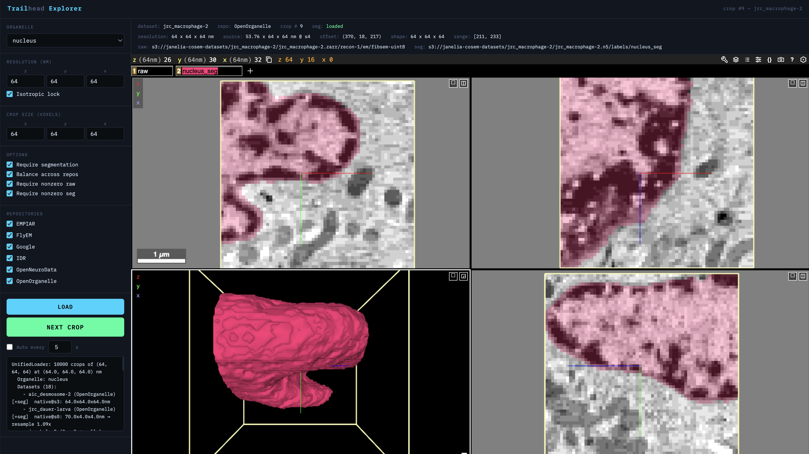

# Trailhead

Cross-repository microscopy training data discovery and loading. Trailhead provides a unified interface to query, load, and visualize EM datasets from multiple public repositories, yielding random crops at a target resolution suitable for training segmentation models.

## Repositories

| Repository | Format | Backend | Datasets |
|---|---|---|---|
| **OpenOrganelle** | Zarr / N5 on S3 | `OpenOrganelleBackend` | 51 (FIB-SEM, organelle segmentations) |
| **MICrONS** | Neuroglancer Precomputed on GCS | `MICrONSBackend` | 2 (minnie65, minnie35) |
| **FlyEM** | Neuroglancer Precomputed on GCS | `MICrONSBackend` | 4 (hemibrain, MANC, optic lobe, FIB-25) |
| **Google** | Neuroglancer Precomputed on GCS | `MICrONSBackend` | 4 (H01, FAFB, FlyWire, Kasthuri) |
| **OpenNeuroData** | Neuroglancer Precomputed on S3 | `MICrONSBackend` | 5 (Bock, Hildebrand, Harris, Wanner, Witvliet) |
| **EMPIAR** | TIFF slices over HTTPS | `EMPIARBackend` | 1 (on-demand slice download with local cache) |
| **IDR** | OME-Zarr on EBI S3 | `IDRBackend` | 1 |
| **CellMap Publications** | N5 on S3 | `OpenOrganelleBackend` | 1 (Heinrich 2021 ground truth crops) |

## Quick start

```bash
# Install with pixi
pixi install

# Search the registry
pixi run demo

# Open the web explorer
pixi run explore
# → http://ackermand-ws2:9000/

# View a single crop in neuroglancer
pixi run view
```

## Python API

The `UnifiedLoader` is the single entry point for all data access. Any external tool or training pipeline can use it to get crops from any supported repository — no need for repository-specific code.

### UnifiedLoader parameters

| Parameter | Type | Default | Description |
|---|---|---|---|
| `organelle` | `str` | `""` | Target organelle for segmentation (e.g., `"mito"`, `"er"`, `"neuron"`) |
| `crop_size` | `(z, y, x)` | `(64, 64, 64)` | Output crop size in voxels |
| `resolution_nm` | `(z, y, x)` or `None` | `None` | Target voxel size in nm. Auto-selects best scale and resamples. `None` = native resolution. |
| `query` | `str` | `""` | Free-text search across dataset titles and IDs |
| `organism` | `str` | `""` | Filter by organism (e.g., `"Homo sapiens"`, `"Drosophila melanogaster"`) |
| `cell_type` | `str` | `""` | Filter by cell type (e.g., `"HeLa"`) |
| `repositories` | `list[str]` or `None` | `None` | Restrict to specific repos (e.g., `["OpenOrganelle", "FlyEM"]`). `None` = all. |
| `num_samples` | `int` | `1000` | Number of crops to yield |
| `seed` | `int` or `None` | `None` | Random seed for reproducibility |
| `require_segmentation` | `bool` | `False` | Only use datasets that have segmentation for the given organelle |
| `balance_repositories` | `bool` | `False` | Sample equally across repositories (otherwise weighted by dataset count) |
| `require_nonempty_raw` | `bool` | `False` | Skip crops where raw is all zeros |
| `require_nonempty_seg` | `bool` | `False` | Skip crops where segmentation is absent or all zeros |

### CropSample fields

Each yielded `CropSample` contains everything needed to use the crop or trace it back to its source:

| Field | Type | Description |
|---|---|---|
| `raw` | `ndarray (z,y,x) uint8` | Raw EM image crop, resampled to target resolution |
| `segmentation` | `ndarray (z,y,x) uint32` or `None` | Segmentation labels (instance IDs, not binary masks) |
| `dataset_id` | `str` | Dataset identifier (e.g., `"jrc_hela-2"`, `"minnie65"`) |
| `repository` | `str` | Source repository name |
| `organelle` | `str` | Organelle that was requested |
| `offset` | `(z, y, x)` | Crop origin in source volume coordinates (at the scale that was read) |
| `resolution_nm` | `(z, y, x)` | Output voxel size in nm |
| `source_resolution_nm` | `(z, y, x)` | Native voxel size at the scale level that was read |
| `scale_used` | `int` | Multiscale level that was read (0 = finest) |
| `seg_status` | `str` | `"loaded"`, `"empty"`, `"failed: ..."`, or `"no_seg_available"` |
| `raw_path` | `str` | Full path/URL to the raw volume |
| `seg_path` | `str` | Full path/URL to the segmentation volume |

### Examples

**Random crops from all mito datasets at 8nm:**

```python
from trailhead import UnifiedLoader

loader = UnifiedLoader(
    organelle="mito",
    crop_size=(64, 64, 64),
    resolution_nm=(8.0, 8.0, 8.0),
    require_nonempty_seg=True,
    balance_repositories=True,
)

for sample in loader.prefetch_iter():
    # sample.raw: (64, 64, 64) uint8 at 8nm isotropic
    # sample.segmentation: (64, 64, 64) uint32 instance labels
    train(sample.raw, sample.segmentation)
```

**Crops from a specific dataset:**

```python
loader = UnifiedLoader(
    query="minnie65",               # match by name
    organelle="mito",
    crop_size=(128, 128, 128),
    resolution_nm=(16.0, 16.0, 16.0),
)
```

**Crops from specific repositories only:**

```python
loader = UnifiedLoader(
    organelle="er",
    repositories=["OpenOrganelle", "MICrONS"],
    crop_size=(64, 64, 64),
    resolution_nm=(8.0, 8.0, 8.0),
    require_segmentation=True,
)
```

**Raw-only crops at native resolution (no resampling):**

```python
loader = UnifiedLoader(
    organism="Drosophila melanogaster",
    crop_size=(64, 64, 64),
    # resolution_nm omitted → reads at native scale 0
)
```

**Reproducible sampling:**

```python
loader = UnifiedLoader(organelle="mito", seed=42, num_samples=50)
# Same seed + params → same sequence of crops
```

### Resolution-based scale selection

The loader automatically picks the best multiscale level for your target resolution and resamples to match:

- Reads voxel size metadata directly from volume files (neuroglancer precomputed `info` JSON, N5 `attributes.json`, zarr `.zattrs`)
- Picks the coarsest scale still finer than or equal to the target in all dimensions
- Computes per-axis zoom factors (`source_voxel / target_voxel`) and works backwards to determine how many source voxels to read: `read_shape = ceil(crop_size / zoom_factors)`. For example, requesting 64³ at 8nm from a 16nm source (zoom=2.0) reads 32³ source voxels, then resamples up to 64³.
- Resamples with `scipy.ndimage.zoom` (bilinear for raw, nearest-neighbor for segmentation) and trims/pads to exact `crop_size`
- Handles anisotropic data (e.g., MICrONS minnie65 at 8x8x40 nm gets per-axis zoom factors to produce isotropic output)

### Search the registry

```python
from trailhead import Registry

reg = Registry()

# Filter by organelle, organism, repository
hits = reg.search(organelle="mito", organism="Homo sapiens")
hits = reg.search(repository="FlyEM")
hits = reg.search(query="cortex", has_segmentation=True)

# List available metadata
reg.list_organelles()    # ['er', 'golgi', 'mito', 'neuron', ...]
reg.list_organisms()     # ['Caenorhabditis elegans', 'Drosophila melanogaster', ...]
reg.list_repositories()  # ['EMPIAR', 'FlyEM', 'Google', 'IDR', 'MICrONS', ...]
```

### Visualize in neuroglancer

```python
from trailhead import UnifiedLoader, view_crop

loader = UnifiedLoader(organelle="mito", crop_size=(64,64,64), resolution_nm=(8,8,8))
sample = next(iter(loader))
viewer = view_crop(sample)
# Opens neuroglancer in browser with raw + segmentation overlay
```

## Web explorer



`pixi run explore` starts a local web server with:

- **Control panel** -- organelle, resolution (nm), crop size, repository filters
- **Options** -- require segmentation, balance across repos, require nonzero raw/seg
- **Embedded neuroglancer** viewer with 1-99% intensity scaling and segment ID listing
- **Metadata bar** -- dataset ID, source/output resolution, offset, scale used, raw/seg paths, segmentation status
- **Background prefetching** -- keeps 5 crops ready in a queue for instant cycling
- **Keyboard shortcuts** -- Space or Right Arrow for next crop
- **Auto-cycle** -- automatically advance every N seconds

The server binds to `0.0.0.0` so it's accessible from other machines on the network.

## Project structure

```
trailhead/
  __init__.py              # Public API exports
  registry.py              # DatasetEntry + Registry (searchable catalog)
  loader.py                # UnifiedLoader (resolution-aware crop iterator)
  app.py                   # Web explorer (tornado + neuroglancer iframe)
  visualize.py             # Neuroglancer helpers (view_crop, view_arrays)
  discover.py              # Dataset auto-discovery agent
  backends/
    base.py                # Backend ABC (get_voxel_size, pick_scale, read crops)
    openorganelle.py       # Zarr-first + N5 fallback, multi-bucket S3
    microns.py             # Neuroglancer precomputed on GCS/S3 (HTTPS for GCS)
    empiar.py              # On-demand TIFF slice download via HTTPS
    idr.py                 # OME-Zarr on EBI S3
  catalog/
    openorganelle.json     # 51 datasets from s3://janelia-cosem-datasets
    microns.json           # MICrONS minnie65/35
```

## Dataset discovery

`pixi run discover` runs an automated discovery agent (`trailhead/discover.py`) that scans multiple public repositories for datasets, extracts metadata, and outputs a `discovered_datasets.json` file with entries ready for the Registry to load.

### How it works

The agent runs four scanning strategies in sequence:

1. **OpenOrganelle S3 scan** — Lists all top-level directories in `s3://janelia-cosem-datasets`, then for each dataset checks `{id}/{id}.n5/em/` for raw EM data and `{id}/{id}.n5/labels/` for segmentation labels. Automatically extracts organelle names from `*_seg` directory names.

2. **EMPIAR API scan** — Queries the [EMPIAR REST API](https://www.ebi.ac.uk/empiar/api/entries/) for recent entries, extracting dataset IDs, titles, organisms, and imaging modalities.

3. **IDR scan** — Queries the [IDR screens API](https://idr.openmicroscopy.org/api/v0/) for datasets available as OME-Zarr.

4. **BioImage Archive scan** — Searches the [BioStudies API](https://www.ebi.ac.uk/biostudies/api/v1/search) for studies matching "electron microscopy segmentation".

Each discovered dataset is saved as a `DiscoveredDataset` with fields matching the `DatasetEntry` schema (id, repository, title, organism, organelles, access_url, raw_path, segmentation_paths, provenance). The results are written to `discovered_datasets.json` which can be reviewed and merged into the catalog JSONs.

### Output

```
Discovery agent starting...

[1/4] Scanning OpenOrganelle S3 bucket...
  Found 51 datasets (14 with segmentations)
[2/4] Scanning EMPIAR API...
  Found 50 entries
[3/4] Scanning IDR...
  Found 20 entries
[4/4] Scanning BioImage Archive...
  Found 20 entries

Total discovered: 141 datasets
  With segmentations: 14
  Raw only: 127

Results saved to discovered_datasets.json
```

## Pixi tasks

| Task | Command | Description |
|---|---|---|
| `demo` | `pixi run demo` | Search registry for mito datasets |
| `view` | `pixi run view` | Load one crop in neuroglancer |
| `explore` | `pixi run explore` | Web explorer with controls + viewer |
| `discover` | `pixi run discover` | Scan repos for new datasets |

## Dependencies

numpy, scipy, tensorstore, zarr, s3fs, httpx, neuroglancer
